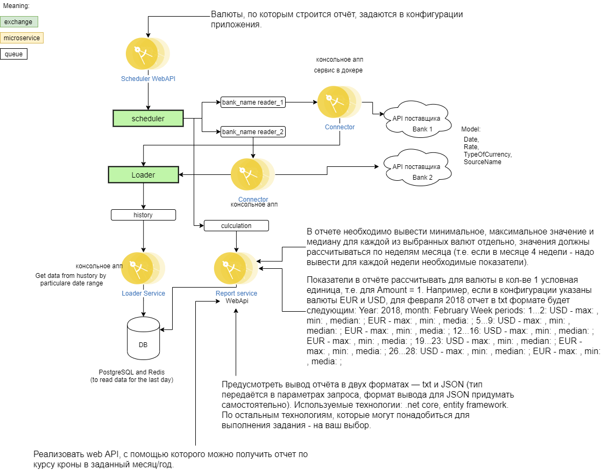

# Tracking the exchange rate of the Czech crown
# Solution architecture
Scheme   
  
Source in drawio [Architecture](./UpdatedArchitecture.drawio) 
Czech National Bank provides the ability to track the exchange rate of the Czech crown 
A daily course is available at https://www.cnb.cz/en/financial_markets/foreign_exchange_market/exchange_rate_fixing/daily.txt?date=27.07.2018
Historical data is available at  https://www.cnb.cz/en/financial_markets/foreign_exchange_market/exchange_rate_fixing/year.txt?year=2018
It is necessary to develop a system consisting of components:
1) A separate console application for filling the database with exchange rate data for 2019 and 2020 (Rate column in CNB reports).
2) A scheduled task that saves the current course in the database. The start period is set up in the configuration.
3) Implement a web API, with which you can get a report on the crown exchange rate in a given month / year. In the report, you must display the minimum, maximum value and median for each of the selected currencies separately, the values ​​must be calculated by weeks of the month (i.e. if there are 4 weeks in a month, you must display the necessary indicators for each week). The currencies used to build the report are set in the application configuration. Calculate the indicators in the report for a currency in a quantity of 1 conventional unit, i.e. for Amount = 1.
For example, if the configuration specifies the currencies EUR and USD, for February 2018 the report in txt format will be as follows: 
Year: 2018, month: February
Week periods:
1...2: USD - max: , min: , median: ; EUR - max: , min: , media: ;
5...9: USD - max: , min: , median: ; EUR - max: , min: , media: ;
12...16: USD - max: , min: , median: ; EUR - max: , min: , media: ;
19...23: USD - max: , min: , median: ; EUR - max: , min: , media: ;
26...28: USD - max: , min: , median: ; EUR - max: , min: , media: ;
Provide the output of the report in two formats - txt and JSON (the type is passed in the request parameters, the output format for JSON must be invented by yourself).
Technologies used: .net core, entity framework. For the rest of the technologies that may be needed to complete the assignment - your choice. 

### Basic services:
#### CzBank.Connector
Service for downloading data (exchange rates) from Czech Bank. Implements a console application for downloading / receiving data from remote (Czech Bank).
[Readme](./Services/CurrencyRates.CzBank.Connector/Readme.md)
#### Loader
Service collects data from different suppliers and converts them to the required type for storage in a database. Implements a console application with methods for getting, transforming, saving data to a database. 
[Readme](./Services/CurrencyRates.Loader/Readme.md)
#### Report.Api 
Service for providing data to the user by currency. Implements API and logic for issuing reports in two formats(txt,json) for a specific period.
[Readme](./Services/CurrencyRates.Report.Api/Readme.md)
#### Scheduler.Api 
Service for creating scheduled tasks. Implements API and logic for adding / editing scheduled tasks 
[Readme](./Services/CurrencyRates.Scheduler.Api/SolutionItems/Readme.md)

### Road map
на 07.11.2021 сделан 
Коннектор:
1) отправка сообщения Шедулера с настройками для регистрации сервиса
2) загрузка данных от поставщика за день.
3) реализовано подключение к брокеру сообщений и отправка результата загрузки данных от поставщика в эксчендж Лоадер
4) Загрузка данных покрыта тестами

Лоадер
1) Подключение к брокеру ообщение
2) Получение и валидация сообщений
3) Преобразование и сохраниене данных в базу данных
4) Автоматическая накатка миграций при старте приложения
5) Покрыта тестами валидация и сохранение данных в бд

Репорт
1) подключение к брокеру сообщений

Шедулер
1) подключение к брокеру сообщений
2) регистрация джобы для сервиса Коннетор
3) Отправка задач по расписанию в зависимости от настроек сервиса который был зарегестрирвоан

### Нужно сделать:
Коннектор
1) загрузка данных за год или за указанный период
2) Тесты
3) Добавить загрузку новостей 

Репорт 
1) сделать ручку для формирования отчетов (расчет медианы) 
2) Добавить возможноть формирования отчета по расписанию
3) Добавить имспользование Редис
4) Сохранять законченный отчет через вебдав на файловое хранилище
5) HelthCheck
6) Апи на GRPC для формирования отчетов за период

Шедулер
1) регистрация задачи для формирования отчета по расписанию
2) HelthCheck
3) RPC от коннектора - шедулеру

Лоадер
1) добавить обработку данных за год и если от поставщика за какой то период
2) DeadLetteralQueue

Добавить сервис Новостей основанный на эластикСерче
Полнотекстовый поиск через редис попробовать
Добавить сервис проксирвоание запросаов nginx и сделать реврайт 

